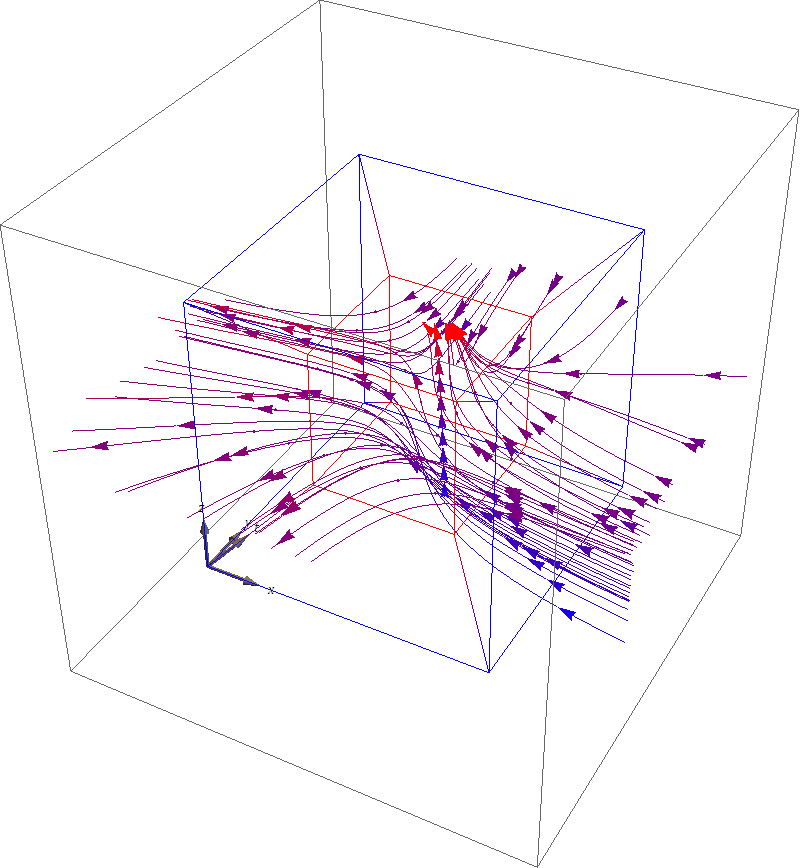

# StreamPlot4D

Usage:
```
StreadmPlot4D[ 
	{ vt, vx, vy, vz }, 
	{ t, tmin, tmax },
	{ x, xmin, xmax },
	{ y, ymin, ymax },
	{ z, zmin, zmax }
  ]
```
generates a stream plot of the vector field `{ vt, vx, vy, vz }` 
as a function of `t`, `x`, `y`, and `z`.
The 4D phasespace will be shown as a 3D perspective projection 
where farther streams are shown in diferent colors.
For help, type `? StreamPlot4D` in Mathematica.

In the following example, 4D phasespace is confined to a tesseract
with the color coding: blue = close, red = farther away.
The 3D axes are `(x,y,z)` and the fourth axis is `t`.
The shown vector field is:
```
	vt = 1, vx = -1 - x^2 + y, vy = 1 + x - y^2, vz = 1
```



The code behind the plot is:
```
StreamPlot4D[
 {1, -1 - x^2 + y, 1 + x - y^2, 1},
 {t, -3, 3},
 {x, -3, 3},
 {y, -3, 3},
 {z, -3, 3},
 VectorPoints -> 0,
 StreamColorFunction -> (Blend[{{-3, Blue}, {3, Red}}, #[[1]]] &),
 ProjectionTo3D -> ({#[[2]], #[[3]], #[[4]]} (1 - 0.5 (#[[1]] + 3)/6) &),
 StreamPoints -> Tuples[{{0}, Range[-3, 3, 1], Range[-3, 3, 1], {0}}],
 StreamArrowheads -> Range[0, 1, 0.1],
 PlotRange -> Automatic, PlotRangePadding -> Scaled[.2],
 Boxed -> True, 
 ImageSize -> Scaled[1]
 ]
```